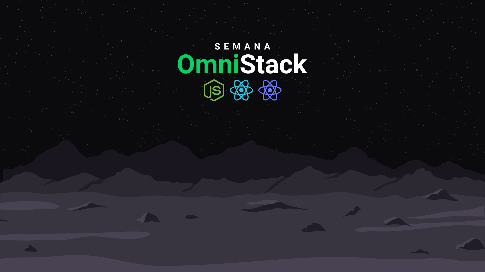
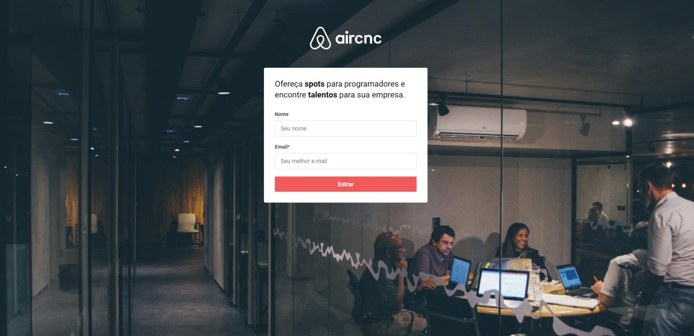
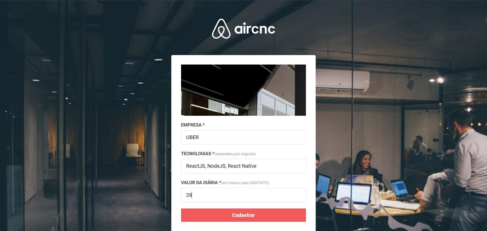
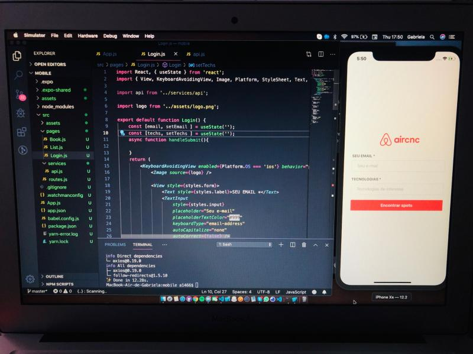
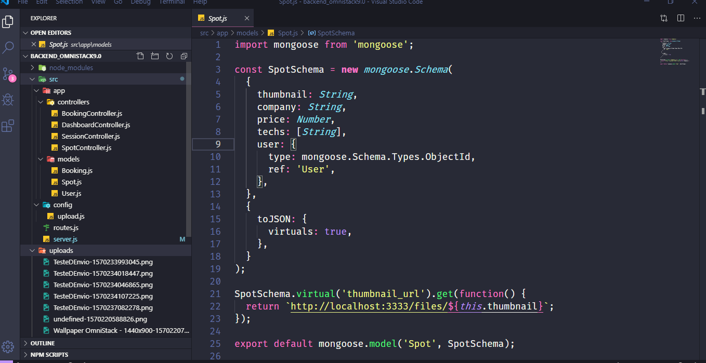

# SemanaOmnistack9
Semana Omnistack 9 de 2019

## Ideia
 Foi elaborado em JavaScript uma aplicacao chamado AirCnc onde podera fazer reservas via app de um spot (local de encontro) onde o desenvolvedor poderia escolher quais spots poderia reservar para o dia especifico via APP e na Web o dono do spot poderia acertar ou cancelar a reserva do local 
 
 # Tecnologias usadas
  *Node.JS
  *React
  *ReactJS
  *React-Native
  *MongoDB
  
  ## Repositorios
 * [App Mobile](https://github.com/RafaelMScience/mobile_omnistack9.0)
 * [Web ReacJS](https://github.com/RafaelMScience/frontend_omnistack9.0)
 * [Backend Node.JS](https://github.com/RafaelMScience/backend_omnistack9.0)
 
    
